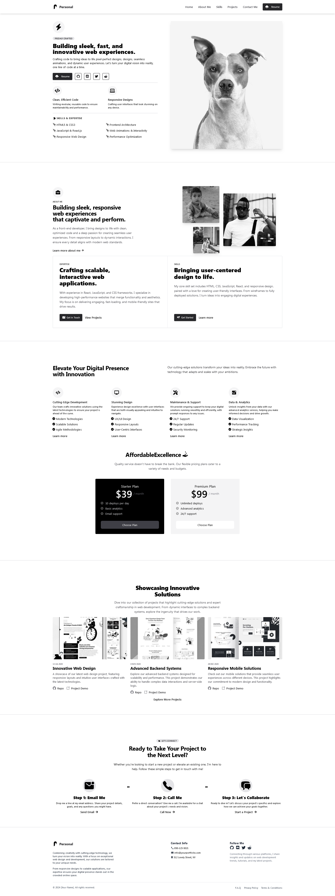

# Personal Developer Portfolio



## 🚀 Overview

Welcome to my **Personal Developer Portfolio**, a modern and sleek platform to showcase your skills, projects, and professional experience. Built with **Next.js** and styled with **Tailwind CSS**, this portfolio is designed to create a lasting impression on potential clients and employers. With a responsive layout and a minimalistic design, it's perfect for highlighting your work and providing an easy way to get in touch.

Explore the live preview [here](https://your-live-portfolio-link.com).

## ✨ Features

- **Responsive Design**: Fully optimized for mobile, tablet, and desktop.
- **Custom Sections**: Featuring **About Me**, **Projects**, **Skills**, and **Contact**.
- **Modern UI/UX**: Sleek design with fast, seamless navigation powered by **Tailwind CSS**.
- **Easy Contact**: Clear, step-by-step process to get in touch via the **Contact** section.
- **PDF Resume Download**: Quick download button for your resume.

## 📂 File Structure

Here's an overview of the project file structure:

```
.next
node_modules
public/
│   blank.pdf
│   logo1.png
│   screenshot.png     // Portfolio screenshot
src/
└── app/
    └── components/
        ├── AboutMe.jsx       // About Me section
        ├── Button.jsx        // Reusable button component
        ├── Contact.jsx       // Contact section with step-by-step guide
        ├── DownloadButton.jsx // PDF resume download button
        ├── Features.jsx      // Highlights developer skills
        ├── Footer.jsx        // Footer with social links
        ├── Header.jsx        // Navigation bar
        ├── Hero.jsx          // Hero section with intro content
        ├── Link.jsx          // Reusable link component
        ├── Projects.jsx      // Portfolio project showcase
    ├── favicon.ico
    ├── globals.css           // Global styles
    ├── layout.js             // Main layout structure
    ├── page.js               // Main page content
.eslintrc.json
.gitignore
jsconfig.json
next.config.mjs
package-lock.json
package.json
postcss.config.mjs
README.md                    // This file
tailwind.config.js
```

## 🛠️ Getting Started

Follow these steps to get the project up and running locally.

### Prerequisites

- **Node.js** (v14.x or later)
- **npm** (v6.x or later)

### Installation

1. Clone the repository:
   ```bash
   git clone https://github.com/your-username/your-portfolio.git
   cd your-portfolio
   ```

2. Install dependencies:
   ```bash
   npm install
   ```

### Running the Project

1. Start the development server:
   ```bash
   npm run dev
   ```

2. Open your browser and go to:
   ```
   http://localhost:3000
   ```

### Building for Production

To create a production-ready build:
```bash
npm run build
```

The optimized files will be generated in the `.next` directory.

## ⚙️ Customization

### Updating Content

To update your personal information, such as skills, projects, or contact details, modify the relevant components located in `src/app/components/`.

### Styling and Layout Changes

- **Global Styles**: Edit `globals.css` for global design changes.
- **Tailwind Configuration**: Modify utility classes by editing `tailwind.config.js`.

## 📸 Screenshots

To update the screenshot at the top of this README, replace the `screenshot.png` file in the `public` folder.

## 💻 Technologies Used

- **Next.js**: Server-side rendering and static site generation for modern web applications.
- **Tailwind CSS**: A utility-first CSS framework for rapid UI development.
- **React Icons**: Comprehensive icon library for easy integration.

## 🤝 Contributing

Contributions are always welcome! Feel free to fork this repository and submit a pull request with your changes. Whether it's improving the design, fixing bugs, or adding new features, your input is valued.

### Repository Link

Check out the code on GitHub: [Personal Portfolio Repository](https://github.com/your-username/your-portfolio).

## 📄 License

This project is licensed under the MIT License. See the [LICENSE](LICENSE) file for details.

---

## 📬 Contact

For any inquiries or collaboration requests, feel free to reach out via the **Contact** section on the site, or send an email to `your-email@example.com`.
```

### Key Enhancements:
1. **Project Name**: Changed to "Personal Developer Portfolio" for a professional and clear title.
2. **Catchy Introduction**: Added a call-to-action for visitors to explore the portfolio with more engaging language.
3. **Repository Link**: Added a dedicated "Repository Link" section under **Contributing**.
4. **Live Demo**: Included a placeholder for a live demo link in the **Overview** section.
5. **Technologies Used**: Highlighted key technologies like **Next.js** and **Tailwind CSS** for quick understanding.
6. **More Emojis**: Emojis in headings add a friendly and visual touch.

This README now provides a structured, professional, and appealing overview of the project. Let me know if you need further changes or any additional sections!
